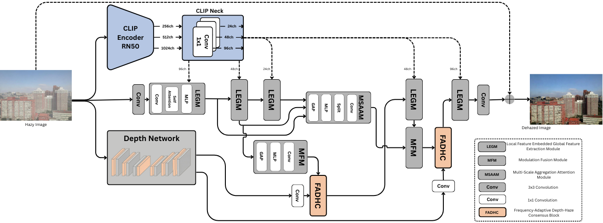
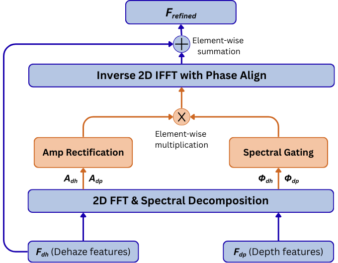

# Frequency-Adaptive Depth-Haze Consensus with Semantic Priors for Single Image Dehazing

Official implementation of the paper **"Frequency-Adaptive Depth-Haze Consensus with Semantic Priors for Single Image Dehazing"**.

## Architecture

The framework utilizes a dual-branch strategy (Dehazing & Depth Estimation) linked by FADHC blocks and guided by semantic features from a frozen ResNet50 CLIP encoder.

<p align="center">
  
</p>

### Key Features:
* **FADHC Block:** Synchronizes phase and magnitude in the Fourier domain to ensure geometric consistency between the recovered image and estimated depth.
* **Semantic Priors:** Leverages the latent space of CLIP to maintain scene context even when structural details are obscured by heavy haze.
* **Multi-Domain Loss:** Optimized using a combination of Spatial (L1, SSIM), Contrastive (CR), and Frequency-domain losses.
<p align="center">
  
</p>

## Getting Started
### 1. Requirements
This code needs [RA-Depth](https://github.com/hmhemu/RA-Depth) Repo to run 
```markdown
git clone https://github.com/AhmedSakr54/FADHC.git
cd ./FADHC
git clone https://github.com/hmhemu/RA-Depth.git
pip install -r requirements.txt
```

### 2. Data
#### CSV File Specification

The dataset loader expects a CSV file to map hazy images to their corresponding ground-truth (clear) images. Below is the technical description of the required columns and their content.

| Column Name | Data Type | Description |
| --- | --- | --- |
| **`image_id`** | Integer | A unique identifier for the scene or clear image. |
| **`clear_image_path`** | String | The absolute or relative system path to the high-quality ground-truth image. |
| **`hazy_image_paths`** | String (List) | A string-formatted Python list containing paths to one or more hazy versions of the `clear_image_path`. |

#### Folder Structure

```markdown
.
└── Data/
    └── ITS/
        ├── clear/
        │   └── 1.png
        └── hazy/
            ├── 1_1_0.90179.png
            ├── 1_2_0.97842.png
            ├── 1_3_0.84256.png
            ├── 1_4_0.92941.png
            ├── 1_5_0.98345.png
            └── 1_6_0.98796.png

```


### 3. Training

To train the model with Frequency-Adaptive Consensus and Frequency Loss:

```bash
CUDA_VISIBLE_DEVICES=0 python trainer.py \
    --model dehaze-model-FADHC-CLIP-ITS \
    --model_depth depth-model-FADHC-CLIP-ITS \
    --exp indoor \
    --use_freq_loss \
    --use_fadhc \
    --config_path ./configs/indoor/default.json

```

### 4. Testing & Inference

For standard evaluation:

```bash
python test.py --model_path ./path/to/model.pth --dataset_path ./data/test/ --out_dir results

```

For high-resolution images or real-world datasets (using sliding window cropping):

```bash
CUDA_VISIBLE_DEVICES=0 python test_crop.py \
    --model dehaze-ITS \
    --model_path ./saved_models/indoor/best_model.pth \
    --dataset indoor \
    --data_dir ./Data/SOTS \
    --data_path ./Data/o-haze-test.csv \
    --out_dir results-1 \
    --window_size 256

```

## Results


| Dataset | PSNR ↑ | SSIM ↑ |
| --- | --- | --- |
| **SOTS-Indoor** | 42.23 | 0.9978 |
| **SOTS-Outdoor** | 37.42 | 0.9961 |
| **O-Haze** | 27.86 | 0.9607 |
| **Dense-Haze** | 20.83 | 0.7369** |
| **NH-Haze** | 24.53 | 0.8740 |

## Acknowledgement

This repository relies on the work of
- [Depth Information Assisted Collaborative Mutual Promotion Network for Single Image Dehazing](https://github.com/zhoushen1/DCMPNet)
- [RA-Depth: Resolution Adaptive Self-Supervised Monocular Depth Estimation](https://github.com/hmhemu/RA-Depth)

